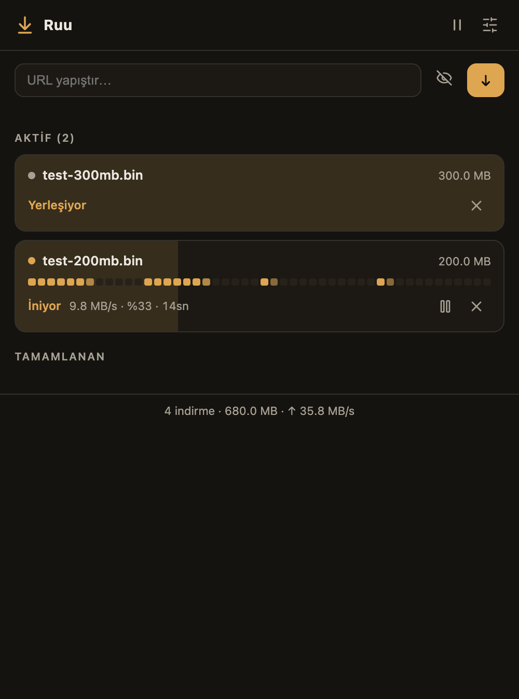

<div align="center">

# ⬇︎ Ruu Downloader

**The download manager Chrome deserves — segmented speed, unkillable resume, zero telemetry.**

[](test/e2e/run.sh)
[](test/)
[](public/_locales/)
[](LICENSE)
[](PRIVACY.md)



*Live segment map, heartbeat pulse, one-word status verbs — the classic IDM mosaic, reimagined calm.*

</div>

---

## Why Ruu?

Classic download managers earned love for three things: **multi-connection speed**,
**bulletproof resume**, and **catching browser downloads**. Ruu rebuilds all three on
modern web platform primitives — no native app, no companion daemon, no ads, no tracking.

| | Chrome alone | Typical extension | **Ruu** |
|---|---|---|---|
| Parallel connections | 1 | fixed split | **dynamic + work-stealing** |
| Survives browser crash | ❌ | ❌ | **✓ byte-exact resume** |
| Expired link recovery | restart from 0% | restart from 0% | **✓ paste new link, keep progress** |
| Merge wait at the end | — | "merging segments…" | **none — positioned writes** |
| Telemetry | — | often | **zero** |

## Features

- ⚡ **Dynamic segmented engine** — 1-8 connections tuned to your device & network;
  when a connection frees up it *steals* half of the largest in-flight segment, so one
  slow mirror never drags the download.
- 💾 **Crash-proof resume** — acknowledged byte ranges are journaled; even a hard
  browser crash resumes byte-exact, with ETag/Last-Modified validation.
- 🔗 **Expired-link rescue** — signed CDN URL died at 95%? Paste a fresh link;
  Ruu verifies it's the same file and continues from where it left off.
- 🧲 **Browser takeover** — one-time opt-in hides Chrome's download bubble and routes
  downloads above your threshold through the engine. A built-in decision log always
  answers *"why wasn't this one taken?"*
- 🗂 **Type-based sorting** — images / video / music / archives / documents / apps,
  each in its own folder (optional, localized).
- 🕶 **Private downloads** — file lands on disk; browser history and stats stay clean.
- 🔔 **Finish modes** — silent · notification with Open button · or **party mode** that
  opens a video of your choice when the download lands 🎵
- 🌍 **11 languages** including RTL Arabic; icon-first, minimal-text UI.
- ♿ **Accessible by default** — ARIA live announcements, full keyboard support,
  `prefers-reduced-motion` respected everywhere.
- 📊 **Local-only stats** — count, bytes, best speed. Nothing ever leaves your machine
  ([PRIVACY.md](PRIVACY.md)).

## Install

**Chrome Web Store:** *in review — link coming soon.*

**From source:**

```bash
git clone https://github.com/mehmetnadir/ruu-downloader
cd ruu-downloader
npm install && npm run build
# chrome://extensions → Developer mode → Load unpacked → dist/
```

## Architecture (the interesting bits)

```
Service Worker  ──►  routing only: takeover, delivery, badge, settings
Offscreen doc   ──►  the engine: parallel Range fetches, dynamic allocator
Disk worker     ──►  OPFS positioned writes — segments land at their final
                     byte offset; there is no merge phase, ever
Side Panel      ──►  pure UI over a keyed renderer (animations never reset)
```

Hard-won platform lessons are documented in code comments: offscreen documents
have no `chrome.storage`; transferred `ArrayBuffer`s detach (`buf.length === 0`);
Chrome 137+ removed `--load-extension` (E2E loads via CDP `Extensions.loadUnpacked`).

## Testing

Nothing ships untested — 43 unit tests plus a one-command E2E harness that drives a
real Chromium against a throttled, fault-injecting local server:

```bash
npm test              # unit
./test/e2e/run.sh     # 7 scenarios: segmented integrity, connection drops,
                      # native fallback, takeover, private downloads,
                      # hard-crash resume, expired-link renewal
HEADLESS=1 ./test/e2e/run.sh   # CI mode
```

Every scenario verifies the downloaded file **byte-by-byte**.

## Roadmap

- 📬 **Mail integration** — a download button next to WeTransfer/Lifebox/Drive links
  right inside Gmail & Outlook; Ruu walks through the share page's consent flow and
  starts the transfer automatically.
- 📱 **Ruu Beam** — see it on your phone, download it on your PC: share-target PWA →
  encrypted relay → Web Push to the extension.
- ⏰ **Queues & scheduling** — bandwidth windows, recurring downloads (data model is
  already in place).
- 👁 **In-panel previews** — peek at images/video/archives *before* the download
  finishes (OPFS makes this possible).
- 🔎 Share-link resolvers (WeTransfer, Dropbox, OneDrive), per-site connection
  profiles, and whatever real users' pain points teach us next.

## Contributing

Issues and PRs welcome. The E2E harness is the contract: `./test/e2e/run.sh` must
stay green.

## License

[MIT](LICENSE) — built in the open, by a human-AI pair, in one very long day.
